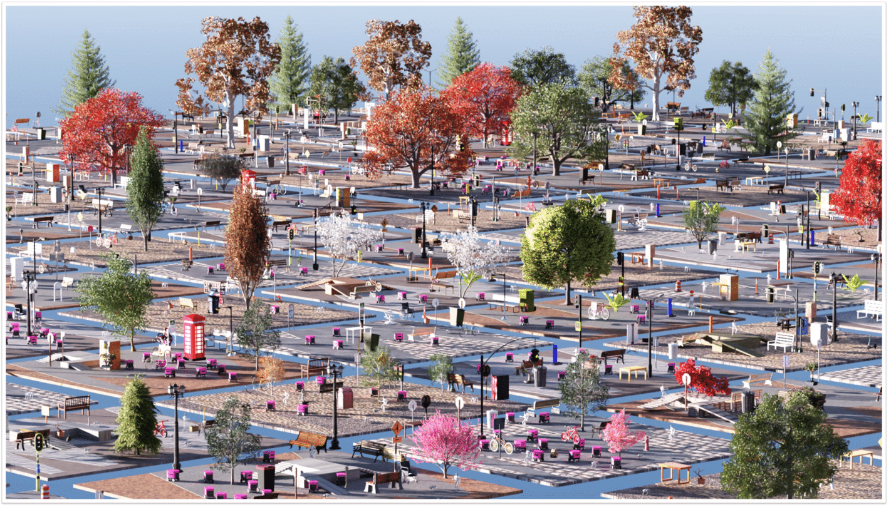

Welcome to URBAN-SIM!
=====================

**URBAN-SIM** is a unified framework for robot learning in urban scenarios, 
including point navigation, obstacle avoidance, pedestrian interaction, etc. 
It is designed to support a wide range of learning paradigms such as reinforcement learning, imitation learning. 
Built on top of `NVIDIA Isaac Sim`_ and `NVIDIA Isaac Lab`_, URBAN-SIM enables high-fidelity photo-realistic rendering,
efficient, asynchronous simulation in large-scale, dynamic environments.

URBAN-SIM provides a variety of environments featuring diverse robots and scenario generation pipelines. We are 
actively expanding the set of supported scenarios to accommodate broader use cases and research needs.

Based on Omniverse, PhysX, OpenUSD provided by NVIDIA Isaac ecosystem, 
the platform is also designed so that you can add your own robots!

.. figure:: assets/teaser.gif
   :width: 100%
   :alt: Example robots

License
=======

The URBAN-SIM framework is open-sourced under the Apache 2.0 license.
Please refer to :ref:`license` for more details.

Acknowledgement
===============
If you find URBAN-SIM helpful for your research, please cite the following BibTeX entry:

.. code:: bibtex

   @inproceedings{wu2025towards,
      title={Towards autonomous micromobility through scalable urban simulation},
      author={Wu, Wayne and He, Honglin and Zhang, Chaoyuan and He, Jack and Zhao, Seth Z and Gong, Ran and Li, Quanyi and Zhou, Bolei},
      booktitle={Proceedings of the Computer Vision and Pattern Recognition Conference},
      pages={27553--27563},
      year={2025}
   }

Table of Contents
=================

.. toctree::
   :maxdepth: 2
   :caption: Isaac Lab

   source/setup/ecosystem
   source/setup/installation/index
   source/setup/installation/cloud_installation
   source/refs/reference_architecture/index

.. toctree::
   :maxdepth: 2
   :caption: Getting Started
   :titlesonly:

   source/setup/quickstart
   source/setup/walkthrough/index
   source/tutorials/index
   source/how-to/index
   source/overview/developer-guide/index

.. toctree::
   :maxdepth: 3
   :caption: Overview
   :titlesonly:

   source/overview/core-concepts/index
   source/overview/environments
   source/overview/reinforcement-learning/index
   source/overview/teleop_imitation
   source/overview/showroom
   source/overview/simple_agents

.. toctree::
   :maxdepth: 2
   :caption: Features

   source/features/hydra
   source/features/multi_gpu
   Tiled Rendering</source/overview/core-concepts/sensors/camera>
   source/features/ray
   source/features/reproducibility

.. toctree::
   :maxdepth: 1
   :caption: Resources
   :titlesonly:

   source/deployment/index
   source/policy_deployment/index

.. toctree::
   :maxdepth: 1
   :caption: Migration Guides
   :titlesonly:

   source/migration/migrating_from_isaacgymenvs
   source/migration/migrating_from_omniisaacgymenvs
   source/migration/migrating_from_orbit

.. toctree::
   :maxdepth: 1
   :caption: Source API

   source/api/index

.. toctree::
   :maxdepth: 1
   :caption: References

   source/refs/additional_resources
   source/refs/contributing
   source/refs/troubleshooting
   source/refs/migration
   source/refs/issues
   source/refs/release_notes
   source/refs/changelog
   source/refs/license
   source/refs/bibliography

.. toctree::
    :hidden:
    :caption: Project Links

    GitHub <https://github.com/isaac-sim/IsaacLab>
    NVIDIA Isaac Sim <https://docs.isaacsim.omniverse.nvidia.com/latest/index.html>
    NVIDIA PhysX <https://nvidia-omniverse.github.io/PhysX/physx/5.4.1/index.html>

Indices and tables
==================

* :ref:`genindex`
* :ref:`modindex`
* :ref:`search`

.. _NVIDIA Isaac Sim: https://docs.isaacsim.omniverse.nvidia.com/latest/index.html
.. _NVIDIA Isaac Lab: https://isaac-sim.github.io/IsaacLab/main/index.html
