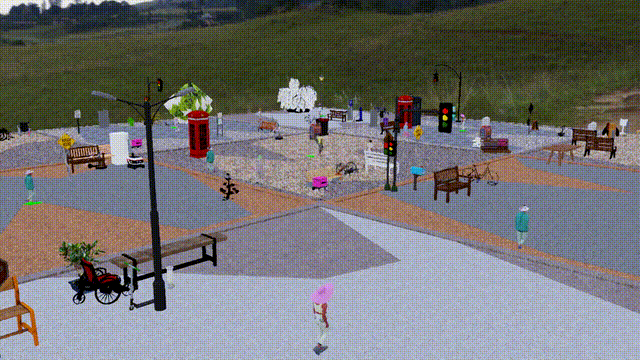

Installation Verification
=============

After installing URBAN-SIM and caching assets, it is important to verify that the installation was successful and that all components are functioning correctly. 
Try to use the code to run a simple simulation and check if the environment loads correctly.

.. code:: bash

   python urbansim/envs/separate_envs/random_env.py --enable_cameras --num_envs ${NUM_ENV} --scenario_type ${TYPE} --use_async

   - `--enable_cameras`: Enables vision-based observation space.
   - `NUM_ENV`: Number of parallel environments to simulate (e.g., 256).
   - `TYPE`: `{clean, static, dynamic}`  
     - `clean`: No obstacles or pedestrians  
     - `static`: Includes static obstacles  
     - `dynamic`: Includes static obstacles and moving pedestrians
   - `--use_async`: Launches environments in asynchronous stepping mode, enabling diverse simulation timings across parallel agents.

If the simulation runs without errors and the environment loads correctly, your installation is successful. If you encounter any issues, please refer to the troubleshooting section in the URBAN-SIM documentation or seek help from the community forums.
The target environment should look like these:

